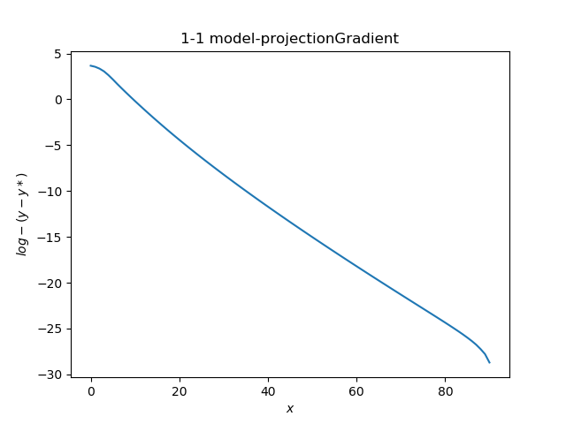
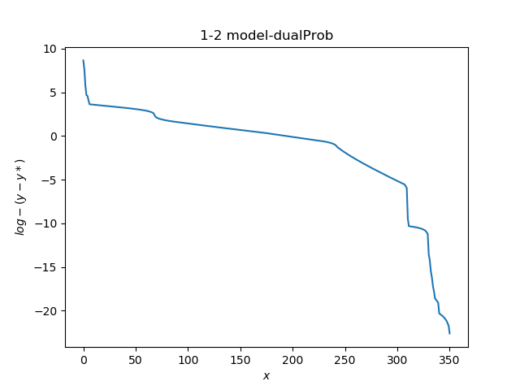
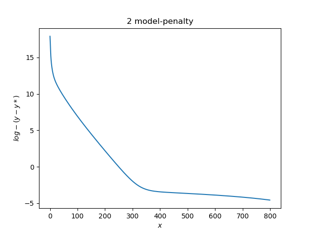
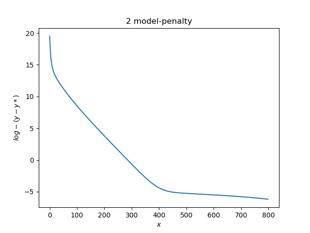
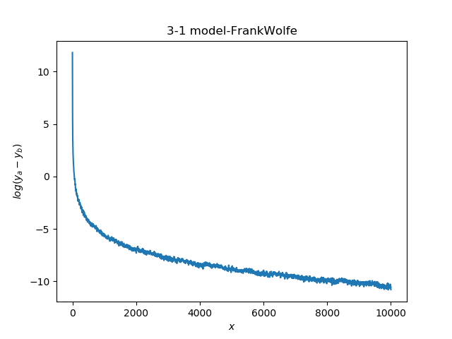
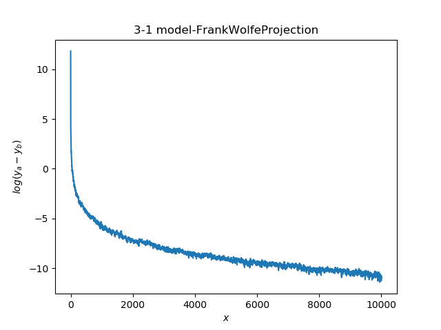
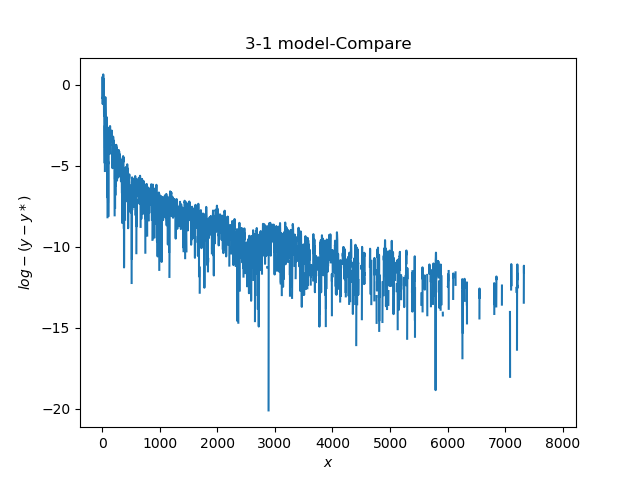
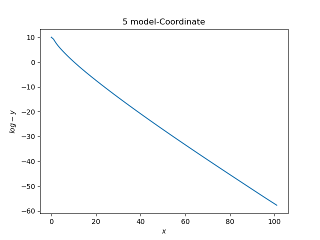

## HW 6

### 1

结论：Dual apporach 比 projected gradient descent with inexact-line 表现差

#### 1-1 Projected Descent

在40次迭代后达到收敛要求。

答案：-164.94922113842483

#### 1-2 Dual apporach

通过设置load，save保持两个问题的一致性。

在300次迭代之后达到与1-1相同的收敛要求，但是由于解决的是dual，相关精度可能不准。

答案：-164.9492386812406

### 2 Penalty

设置惩罚系数0.1，在300次左右收敛速度减慢。

设置惩罚系数到0.2,0.4,0.5，发现收敛速度变慢的位置逐渐后移。

设置惩罚系数0.5，在400次左右收敛速度减慢。

惩罚系数0.1 比 0.5 好。

### 3

#### 3-1 L1-norm

结论：前阶段，单 FrankWolfe 比 projected after FrankWolfe 表现好（单FW值更小），后阶段单FW值更大，但是差别不大。0.2056

#### 3-2 Linf-norm

结论：单 FrankWolfe 比 projected after FrankWolfe 表现差, 单F更大的rate=0.685

### 4

使用书中给出的两种收敛判定方法进行判定

### 5

最后两者的norm-l2为：158.26